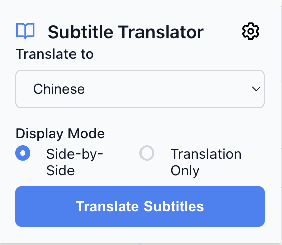
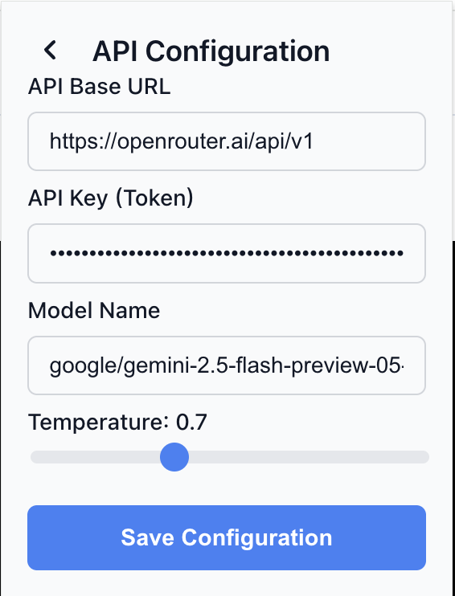
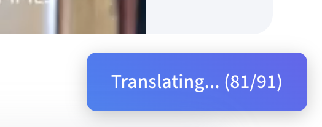

# Coursera Subtitle Translator

[简体中文](README.zh-CN.md)

This browser extension enhances your Coursera learning experience by translating video subtitles into your preferred language in real-time. It uses Large Language Models (LLMs) via any OpenAI-compatible API to provide accurate, context-aware translations, displayed either alongside the original text or as a replacement.

### Gallery

| Main Interface | API Settings |
| :---: | :---: |
|  |  |
| **Translation Progress** | **Bilingual Display** |
|  |  |

## Features

- **Real-time Translation**: Translates subtitles as you watch.
- **Multiple Languages**: Supports a wide range of target languages.
- **Customizable Display**: Choose between a bilingual (side-by-side) view or a translation-only view.
- **Bring Your Own API Key**: Integrates with any OpenAI-compatible API, giving you control over translation quality and cost.
- **Context-Aware**: Provides surrounding subtitle lines to the API for more accurate translations.
- **User-Friendly Interface**: A simple popup allows for easy configuration.
- **Translation Caching**: Caches translations to speed up repeated views and reduce API calls.

## How It Works

1.  **Configuration**: Before first use, you need to configure the extension with your API credentials.
    -   Click the extension icon and go to "API Settings".
    -   Enter your API Base URL, API Key, and the desired Model Name. The default is set for OpenRouter.ai, but any OpenAI-compatible service will work.
    -   Save the configuration.

2.  **Translation**:
    -   Navigate to a Coursera video page.
    -   Click the extension icon.
    -   Select your desired target language and display mode.
    -   Click "Translate Subtitles".

The extension will then fetch the English subtitles, send them to the configured API for translation, and display the results directly in the video player. A progress indicator will keep you updated on the status.

## Installation

Currently, this extension is not on the Chrome Web Store. To install it, you need to load it as an unpacked extension in a Chromium-based browser (like Google Chrome, Brave, or Edge).

1.  **Download**: Download or clone this repository to your local machine.
2.  **Open Extensions Page**: Open your browser and navigate to `chrome://extensions`.
3.  **Enable Developer Mode**: Turn on the "Developer mode" toggle, usually located in the top-right corner.
4.  **Load Unpacked**: Click the "Load unpacked" button and select the directory where you downloaded the repository.
5.  **Done**: The extension should now be installed and ready to use!

## Technology

-   **Manifest V3**: Built using the modern Chrome Extension platform.
-   **Large Language Models (LLMs)**: Leverages the power of LLMs for high-quality, context-aware translation via user-provided OpenAI-compatible APIs.
-   **Vanilla JS**: No heavy frameworks, just clean, efficient JavaScript.
-   **Fetch API**: Used for communicating with the translation service.
-   **HTML/CSS**: For the popup interface.