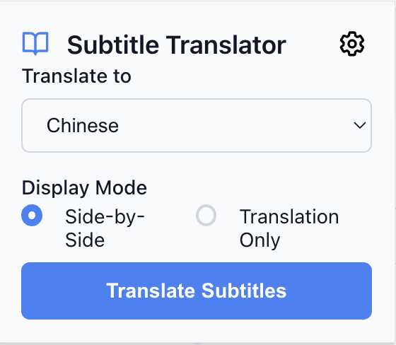
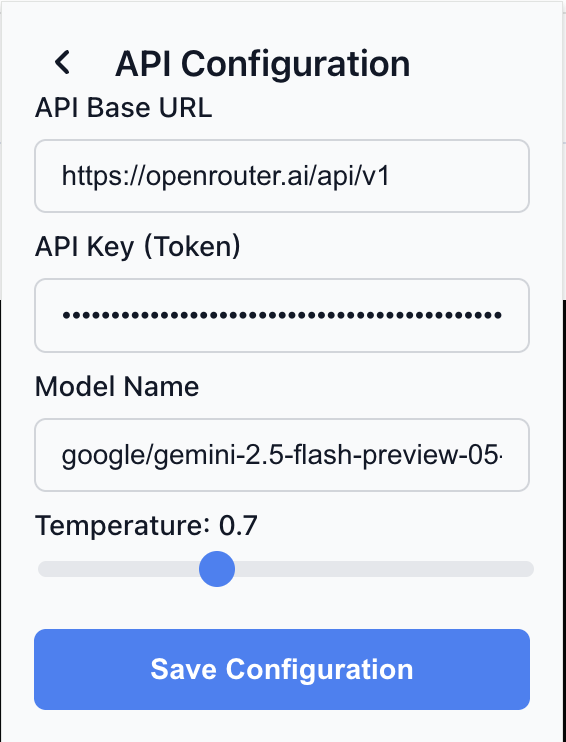
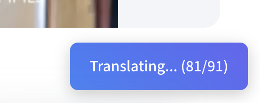
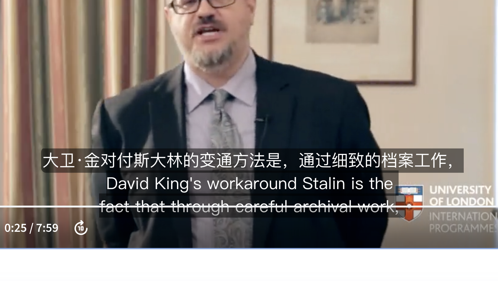

# Coursera 字幕翻译器

[English](README.md)

这款浏览器扩展可以实时将 Coursera 视频字幕翻译成您偏好的语言，从而提升您的学习体验。它通过任何兼容 OpenAI 的 API 调用大语言模型（LLM）来提供准确且具备上下文感知能力的翻译，并可以选择与原文并排显示或直接替换。

### 产品截图

| 主界面 | API 设置 |
| :---: | :---: |
|  |  |
| **翻译进度** | **双语显示** |
|  |  |

## 主要功能

- **实时翻译**: 在您观看视频时同步翻译字幕。
- **多语言支持**: 支持多种目标语言。
- **自定义显示**: 可选择双语（并排）视图或仅译文视图。
- **自带 API 密钥**: 可与任何兼容 OpenAI 的 API 集成，让您自由控制翻译质量和成本。
- **上下文感知**: 将相邻的字幕行一并提供给 API，以获得更准确的翻译。
- **简洁的用户界面**: 通过简单的弹出窗口即可轻松完成配置。
- **翻译缓存**: 缓存翻译结果，以加快重复观看时的速度并减少 API 调用。

## 工作原理

1.  **配置**: 首次使用前，您需要配置您的 API 凭据。
    -   点击扩展图标，进入"API 设置"。
    -   输入您的 API Base URL、API 密钥和所需的模型名称。默认设置为 OpenRouter.ai，但任何兼容 OpenAI 的服务都可以使用。
    -   保存配置。

2.  **翻译**:
    -   打开一个 Coursera 视频页面。
    -   点击扩展图标。
    -   选择您的目标语言和显示模式。
    -   点击"翻译字幕"。

扩展程序将获取英文字幕，将其发送到您配置的 API 进行翻译，并将结果直接显示在视频播放器中。一个进度条会实时显示翻译状态。

## 安装方法

目前，该扩展尚未发布到 Chrome 网上应用店。您需要通过在基于 Chromium 的浏览器（如 Google Chrome、Brave 或 Edge）中加载未打包的扩展程序来安装它。

1.  **下载**: 下载或克隆此仓库到您的本地计算机。
2.  **打开扩展程序页面**: 打开浏览器并访问 `chrome://extensions`。
3.  **启用开发者模式**: 打开通常位于右上角的"开发者模式"开关。
4.  **加载已解压的扩展程序**: 点击"加载已解压的扩展程序"按钮，然后选择您下载仓库的目录。
5.  **完成**: 扩展程序现在应该已经安装并可以使用了！

## 技术栈

-   **Manifest V3**: 使用现代 Chrome 扩展平台构建。
-   **大语言模型 (LLM)**: 通过用户提供的兼容 OpenAI 的 API，利用 LLM 的强大能力实现高质量、具备上下文感知的翻译。
-   **原生 JS**: 没有使用任何笨重的框架，代码简洁高效。
-   **Fetch API**: 用于与翻译服务进行通信。
-   **HTML/CSS**: 用于构建弹出窗口界面。 